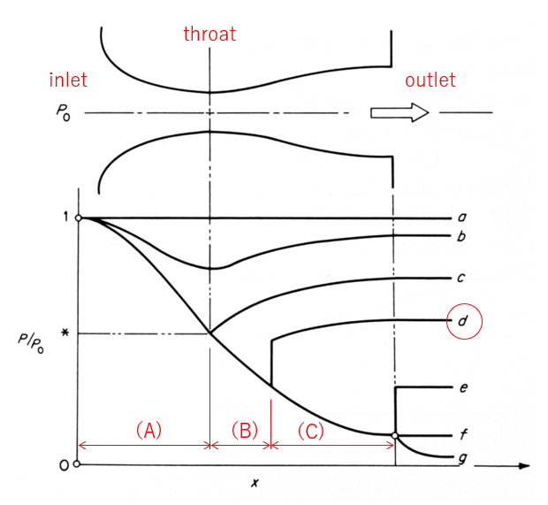
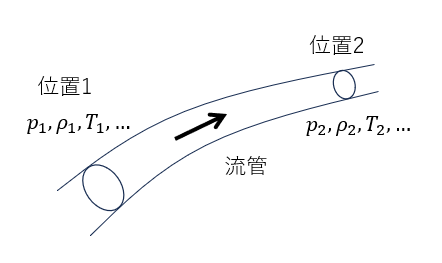

# 1. 概要

圧縮性流体を加速するためにラバルノズルという装置が使われる。ここでは、①理論解の導出、②OpenFOAMを使った解析結果、について紹介する。なお参考にした解析モデルは、NASAの検証計算例で使用されているものである。

[ラバルノズルの検証例題](https://www.grc.nasa.gov/WWW/wind/valid/cdv/cdv.html)

# 2. ラバルノズルを通過する流れの理論解

ラバルノズルとは先細末広タイプのノズルであり、超音速流れを加速するために使用される装置である。形状は単純であるが、流体の非線形効果により境界条件に依存して流れの様子が大きく変化する。

典型的なラバルノズル内の流れの様子を以下の図に示す。貯気槽(reservoir)から供給されたガスは inletからノズル内に流入し、outletから流出する。流路断面積は中央部で最小となるような形状となっており、最小断面位置はthroatと呼ばれる。

流出境界(outlet)での圧力$p_0$が流入境界(inlet)の圧力$p_e$と等しい場合は流体は静止しているが、outletでの圧力$p_e$を下げると流れが生じる。圧力低下量が小さい場合には領域全体で亜音速状態で流れる（図中の曲線b）。

outletでの圧力をさらに下げるとある時点でthroat点でのマッハ数が１に到達する（図中の曲線c)。

outletでの圧力をさらに下げるとthroatを通過する流れは超音速となるが、流出境界付近ではまだ亜音速状態のままとなっておりノズル内に垂直衝撃波が発生する（図中の曲線d)。

outletでの圧力をさらに下げると最終的にはthroatから下流側が全て超音速流れになる。なおthroatでのマッハ数が1になると流れはチョーク状態となるため、outletでの圧力を下げても流量は不変となる。

今回の解析は**曲線d**を対象にして行うことにした。この場合、ゾーン(A)は亜音速、ゾーン（B)は超音速、ゾーン（C)は亜音速流れとなる。

理論解を導出する際に使用する方程式を記述する

## 2.1. 一様エントロピー関係式

これは圧縮性流体の運動方程式から導かれる式であり、非圧縮性流体のベルヌイの式に対応している。流管上の任意の２点間には以下の関係式が成り立つ。ここで$\gamma$は比熱比、$M$はマッハ数、$p$は圧力、$T$は温度、$\rho$は密度、$u$は流速、$A$は流路断面積を表す。

$$
\begin{align}
\frac{p_1}{p_2}&=\left[
\frac{1+\frac{\gamma-1}{2}M_1^2}
{1+\frac{\gamma-1}{2}M_2^2}
\right]^{\frac{-\gamma}{\gamma-1}} \tag{1} \\
\frac{T_1}{T_2}&=\left[
\frac{1+\frac{\gamma-1}{2}M_1^2}
{1+\frac{\gamma-1}{2}M_2^2}
\right]^{-1}   \tag{2}  \\
\frac{\rho_1}{\rho_2}&=\left[
\frac{1+\frac{\gamma-1}{2}M_1^2}
{1+\frac{\gamma-1}{2}M_2^2}
\right]^{\frac{-1}{\gamma-1}}   \tag{3}\\
\frac{u_1}{u_2}&=\frac{M_1}{M_2}\left[
\frac{1+\frac{\gamma-1}{2}M_1^2}
{1+\frac{\gamma-1}{2}M_2^2}
\right]^{\frac{1}{2}}   \tag{4}\\
\frac{A_1}{A_2}&=\frac{M_2}{M_1}\left[
\frac{1+\frac{\gamma-1}{2}M_1^2}
{1+\frac{\gamma-1}{2}M_2^2}
\right]^{\frac{(\gamma+1)}{2(\gamma-1)}}   \tag{5}
\end{align}
$$

